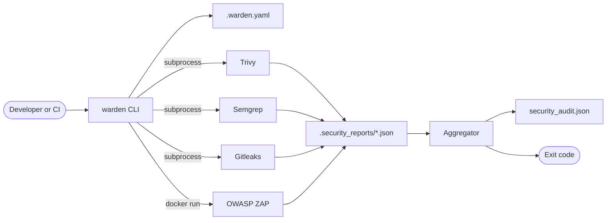

# Architecture overview

Warden is an orchestrator. It runs no analysis of its own — its job is to
invoke four third-party scanners consistently, reconcile their incompatible
output formats into one model, and reduce the result to a single exit code.

## System context

The three static scanners run as subprocesses against the filesystem. ZAP is
different: it is a container launched through the Docker daemon, and it needs a
running application rather than source files.

## Components

All under `src/warden/`.

| Module | Responsibility |
| --- | --- |
| `cli.py` | Entry point. Parses arguments, sequences the stages, prints progress, returns the exit code. |
| `config.py` | Parses `.warden.yaml` and resolves it against CLI arguments into a `ResolvedConfig`. Also the `warden-config` entry point. |
| `tooling.py` | Prepares the report directory and runs a scanner's command line through a `CommandRunner`. The only module that touches subprocesses. |
| `aggregate.py` | Assembles the report from the parsed findings and writes it. Also the `warden-aggregate` entry point. |
| `_parsers.py` | Turns each tool's JSON into `Finding` records and normalises severities. |
| `_summary.py` | Judges findings into a `Verdict` — counts, category breakdown, and whether the build fails — and prints the terminal table from one. |
| `_json.py` | Type-narrowing helpers for walking untrusted JSON. A file it cannot parse comes back as an error, not a printed warning. |
| `_scanners.py` | One `Scanner` record per tool Warden knows about, the registry of them, and the code that builds each one's command line. |
| `_models.py` | Shared dataclasses, typed dicts, and constants. No logic. |

The dependency direction is one-way: `cli` depends on `config`, `tooling`, and
`aggregate`, which do not depend on each other. Every module that needs to know
which scanners exist reads `_scanners`, which depends on `_parsers` because each
record carries its tool's parser. `aggregate` depends on `_parsers` and
`_summary`; those depend on `_json`. `_models` is a leaf, and holds no behaviour
— a record that needs a derived accessor lives with the code that uses it, which
is why `Verdict` sits in `_summary.py` and `Scanner` in `_scanners.py`.

`aggregate.py` and its three helper modules were one file until the parsing,
rendering, and JSON-walking concerns had each grown large enough to change for
their own reasons.

## Data flow through a scan

1. **Resolve configuration.** `config.resolve_config` reads `.warden.yaml` if
   present and merges it with CLI arguments. A missing or unparsable file yields
   defaults.
2. **Prepare the report directory.** `.security_reports/` is created in the
   project root, and appended to `.gitignore` if that file exists and does not
   already list it. Any report left by a previous run is deleted, so a tool that
   is now disabled or that crashes cannot contribute stale findings.
3. **Run each enabled tool.** Each writes its native JSON into the report
   directory. A tool that is missing or fails produces a warning; the sequence
   continues regardless.
4. **Aggregate.** Each report file that exists is parsed into a common `Finding`
   record and severities are normalised onto one scale.
5. **Report and exit.** Findings are sorted by severity, written to
   `security_audit.json`, judged into a verdict, and summarised as a table. The
   verdict becomes the exit code.

The stages communicate through files on disk, not in memory. That is why
`warden-aggregate` can run standalone against a directory of reports that some
other process produced.

## Design notes

### Failure is non-fatal by default

A scanner that is missing or crashes does not abort the run or fail the build.
The rationale is that a partial scan is more useful than none — but the
consequence is that a green build does not prove every scanner ran. `tools_run`
in the report records which reports were actually found.

A report file that exists but cannot be parsed — a tool that crashed mid-write —
is treated the same way. `load_json` returns a `LoadedJson`: the parsed data, or
the reason it could not be read. The leaf module therefore does no terminal I/O,
and the diagnostic can be asserted as a value. `aggregate` surfaces it, because
it is the module iterating `SCANNERS` and so the one that knows which scanner
the file belonged to. Its findings are lost and it is absent from `tools_run`,
but the run continues.

### Only Critical and High fail the build

`DEFAULT_FAIL_ON_SEVERITIES` is `("CRITICAL", "HIGH")`. The threshold is a fixed
constant that nothing in the CLI or config file exposes. Lower severities are
still collected and reported.

The decision is a value rather than a side effect of printing one. `_summary.judge`
reads that constant and returns a `Verdict`: which of those severities were
actually present, alongside the counts and breakdown the table is drawn from.
`Verdict.failed` is derived from that list rather than stored, so the exit code and
the `PASS`/`FAIL` line cannot disagree. `aggregate.generate_report` returns the
verdict, `cli.run_audit` reduces it to the exit code, and `_summary.print_summary`
takes one and only prints — so whether a scan failed can be asserted without
rendering anything.

Two normalisation choices interact with this and are worth stating plainly:
Gitleaks findings are assigned `CRITICAL` unconditionally, so any detected
secret fails a build; and Semgrep's `ERROR` maps to `HIGH`, so Semgrep's own
notion of a serious finding also fails a build. See
[Report format](../reference/report-format.md#severity-normalisation).

### The config parser is deliberately minimal

`.warden.yaml` is read by about 110 lines of hand-written parsing rather than
a YAML library, which keeps the runtime dependency list to `rich` and `semgrep`.
The trade-off is real: only the exact shapes Warden needs are supported, and
unsupported syntax is ignored rather than rejected, so a malformed config
degrades to defaults silently. `warden-config` exists largely to make that
failure mode visible.

### One record per scanner

Everything Warden knows about a scanner is one `Scanner` record in
`_scanners.py`: its display label, its report filename, its summary category and
where that category sorts, its parser, the function that builds its command
line, the exit codes it may return, and whether it needs a target URL. The
`.warden.yaml` key is derived from the label rather than stored alongside it, so
the lowercase and capitalised forms of a tool name cannot drift apart; a label
that would not survive lowercasing is rejected when the record is constructed.

`SCANNERS` is those records in report order, and every list of tools in the
codebase is a read of it — the files cleared before a run, the stages the CLI
prints, the reports the aggregator parses, `tools_run`, the recognised config
keys, the summary categories and their display order. Adding a scanner is
adding a record and its parser and command builder; nothing else in the package
enumerates tools.

Display order in the summary breakdown is deliberately not report order
(`Secrets, Code, Deps, ZAP` against `Trivy, Semgrep, Gitleaks, ZAP`), so each
record carries a `summary_order` and `CATEGORY_ORDER` is derived by sorting on
it, rather than being a second hand-written list that could fall out of step.

### Commands reach the operating system through a runner

`tooling.py` does not reach for `subprocess` on its own account. `run_scanner`
takes a `CommandRunner`: a callable given the argument vector, working
directory, environment overrides, and stderr handling, which returns a
`CommandResult`. `cli.py` passes the production adapter, `tooling.run_subprocess`;
tests pass a fake that records what it was asked to run. The seam is what makes
the ZAP invocation and its host-path resolution testable without Docker.

Every scanner goes through that one function, ZAP included. `run_scanner` asks
the record for its `Command` — argument vector, working directory, and how the
process should be run — and hands it to the runner, so dispatch has no per-tool
branch and no table of runners to keep in step with the registry.

### ZAP runs as a sibling container

The other three tools are executables on `PATH`. ZAP is invoked as
`docker run ... ghcr.io/zaproxy/zaproxy:stable`, which has two consequences.

First, Docker is a hard prerequisite of both installers even though only the
DAST stage uses it.

Second, when Warden is *itself* containerised, the report path it wants to
mount is a path inside its own container, which the host's Docker daemon cannot
resolve. The `WARDEN_HOST_REPORT_DIR`, `WARDEN_HOST_WORKSPACE`, and
`GITHUB_WORKSPACE` environment variables exist to supply the host path instead.
This is the reason the GitHub Action passes `GITHUB_WORKSPACE` through.

Its record sits in the registry with the other three, but its run behaviour is
deliberately not unified with theirs: it takes a target URL instead of a project
root, runs with the report directory as its working directory, and is the one
stage the CLI special-cases.

### The container runs unprivileged

The image runs as UID 10001 rather than root. Because callers are expected to
override the UID with `--user` to match the owner of the mounted project, the
image cannot rely on a fixed home directory — scanner caches and settings live
under a world-writable `/var/tmp/warden`, and `safe.directory` is set
system-wide so Gitleaks can read a repository owned by another user.

### Wrappers exist for source checkouts

`bin/` holds shell, PowerShell, and batch wrappers that locate the project root
and delegate to the installed CLI, preferring `uv run` and falling back to
`python -m warden`. They exist so the tool is runnable from a plain checkout
without installation. They add no behaviour of their own.

## Trade-offs not taken

Three limitations are consequences of the design rather than oversights:

- **No incremental or diff-aware scanning.** Every run scans the whole tree.
- **No severity policy per tool.** You can disable a tool entirely, but you
  cannot say "fail on Trivy High but not Semgrep High".
- **No suppression mechanism.** There is no allowlist or baseline file, so a
  finding you have accepted will fail every subsequent build. Excluding the
  containing directory is the only lever, and it is a blunt one.
